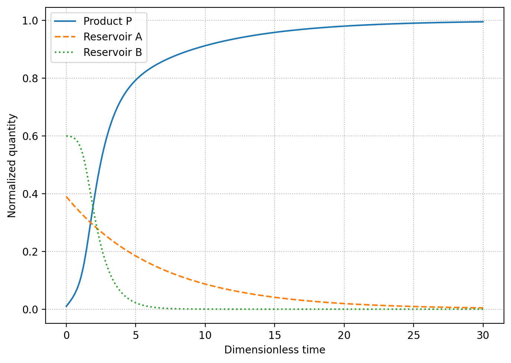
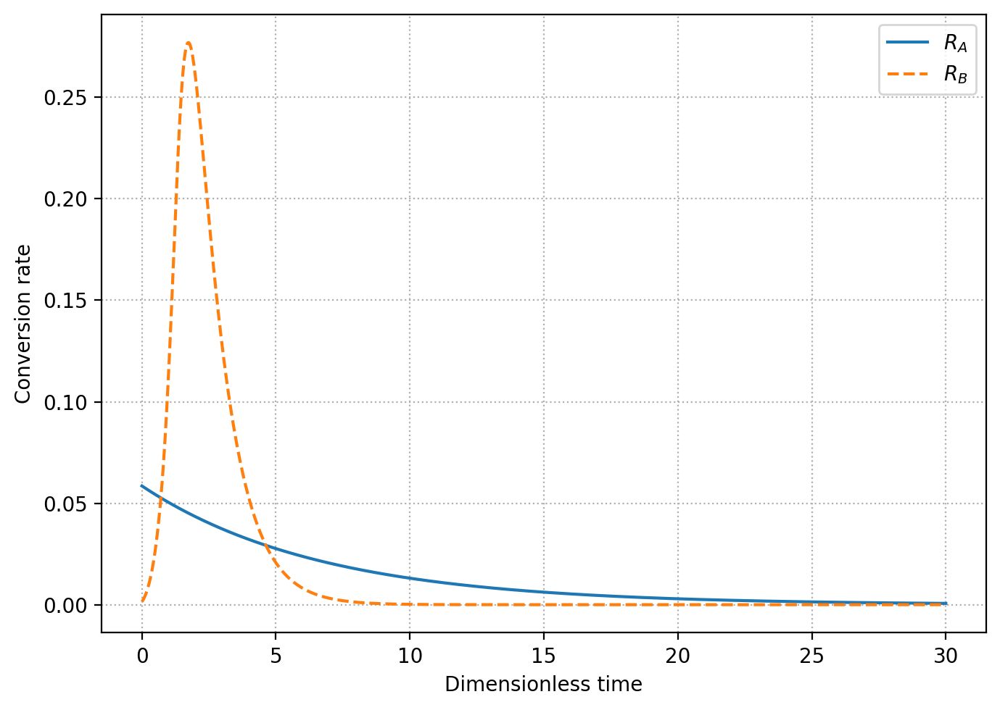
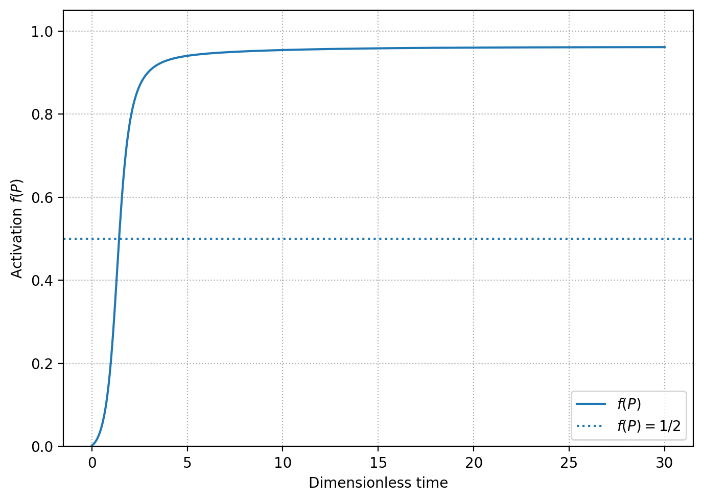
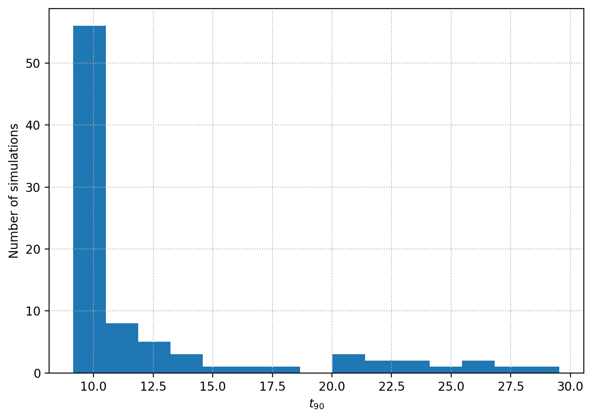
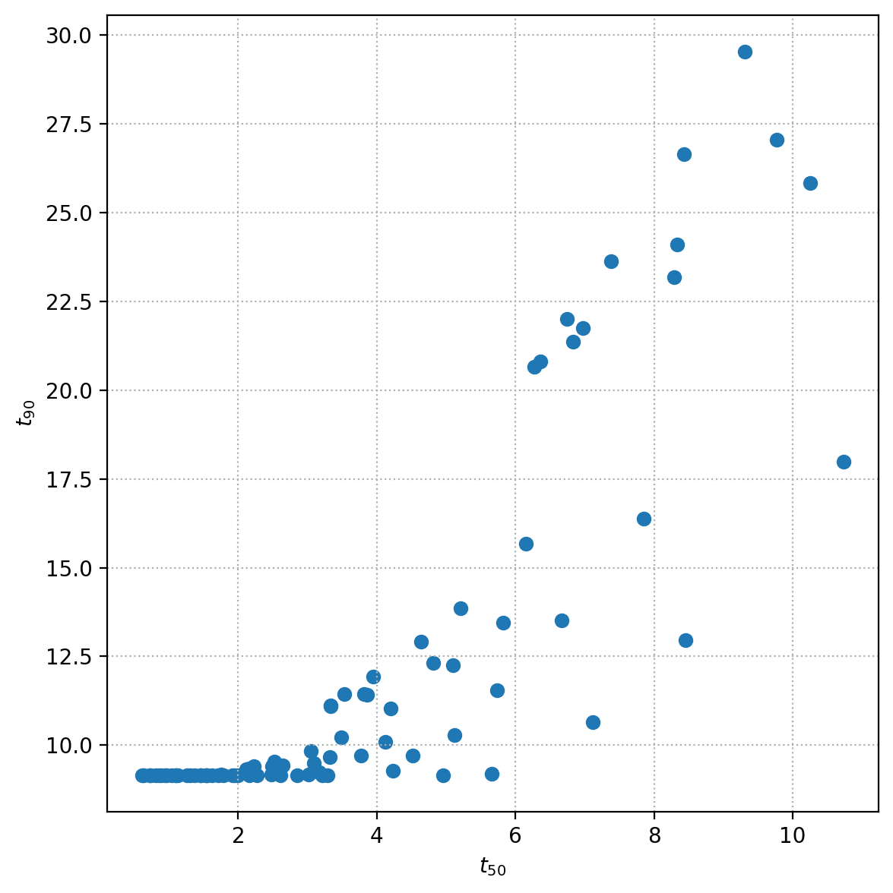
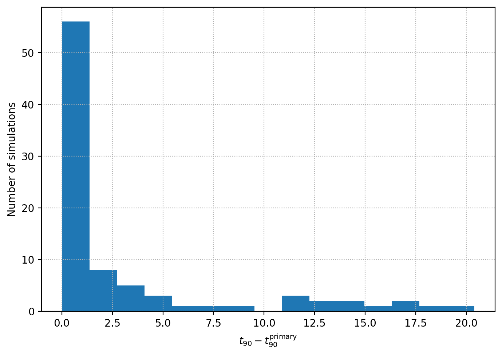
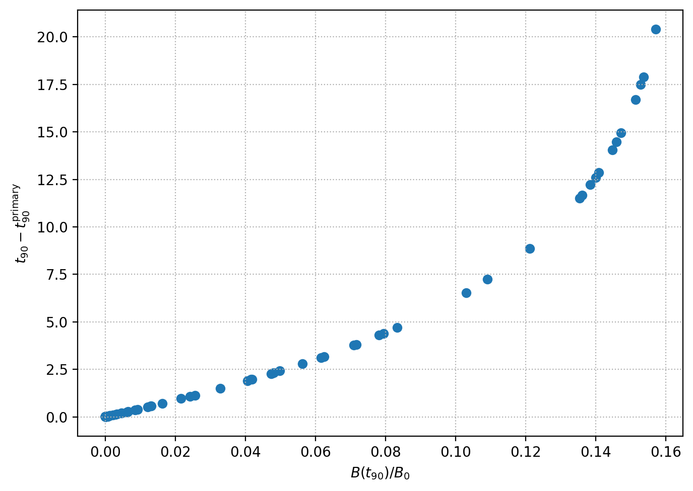
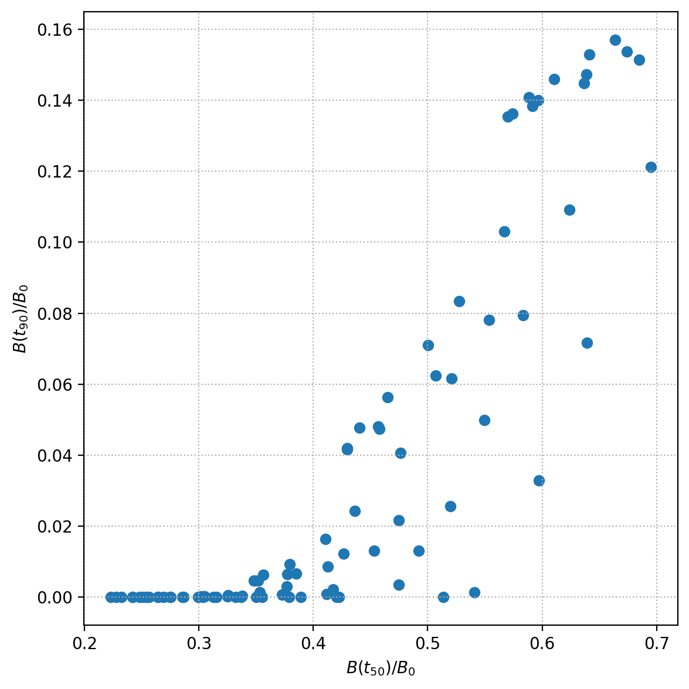

# Nonlinear Balance Solver

A compact Python package for solving, analysing, validating, and exploring nonlinear coupled balance-equation systems.

The project provides a transparent scientific-computing example based on a finite-reservoir conversion model with nonlinear feedback, numerical integration, analytical validation, multidimensional parameter sweeps, and physically motivated dynamical diagnostics.

The repository is designed as a small but complete computational workflow:

```text
mathematical model
        ↓
numerical integration
        ↓
analytical validation
        ↓
parameter-space exploration
        ↓
dynamical diagnostics
        ↓
regime identification
```

---

## Model

The system contains three dimensionless dynamical variables:

- `P(t)`: accumulated product,
- `A(t)`: primary reservoir,
- `B(t)`: secondary reservoir.

The two conversion rates are

\[
R_A = k_A A,
\]

and

\[
R_B =
k_B B
\frac{P^n}{K^n + P^n}.
\]

The corresponding balance equations are

\[
\frac{dP}{dt}
=
R_A + R_B,
\]

\[
\frac{dA}{dt}
=
-R_A,
\]

and

\[
\frac{dB}{dt}
=
-R_B.
\]

The secondary channel contains a Hill-type nonlinear activation function,

\[
f(P)
=
\frac{P^n}{K^n + P^n},
\]

which introduces an effective positive feedback.

As `P` increases, the conversion efficiency of reservoir `B` increases. Since `B` is finite, this feedback is naturally limited by reservoir depletion.

---

## Conservation law

The model satisfies the exact balance relation

\[
P(t)+A(t)+B(t)
=
P_0+A_0+B_0.
\]

For the default normalized initial conditions,

\[
P_0+A_0+B_0=1.
\]

This conservation law provides a direct numerical consistency check for every computed solution.

---

## Reference configuration

The default model uses

```text
P0  = 0.01
A0  = 0.39
B0  = 0.60

k_A = 0.15
k_B = 1.00
K   = 0.20
n   = 2
```

The primary reservoir drives the initial evolution.

As `P` increases, the nonlinear secondary channel becomes progressively activated and eventually contributes strongly to the conversion process.

The reference evolution follows the qualitative sequence

```text
baseline conversion
        ↓
secondary-channel growth
        ↓
nonlinear activation
        ↓
reservoir depletion
```

---

## Reference evolution

The full nonlinear solution shows the conversion of the two finite reservoirs into the accumulated product.



For the reference configuration, the secondary reservoir becomes almost completely depleted during the evolution, while the total quantity remains conserved within numerical precision.

---

## Conversion rates

The instantaneous conversion rates are

\[
R_A=k_AA,
\]

and

\[
R_B=
k_BB
\frac{P^n}{K^n+P^n}.
\]



For the reference solution, the secondary channel becomes dynamically dominant before the nonlinear activation function reaches its half-maximum value.

The approximate characteristic times obtained with the default numerical grid are

\[
t_{\mathrm{cross}}
\simeq 0.72,
\]

for

\[
R_B\geq R_A,
\]

and

\[
t_{\mathrm{act}}
\simeq 1.44,
\]

for

\[
P=K.
\]

These values illustrate that dynamical dominance of the secondary channel and the formal nonlinear activation scale are distinct quantities.

---

## Nonlinear activation

The nonlinear response is controlled by

\[
f(P)
=
\frac{P^n}{K^n+P^n}.
\]

The activation reaches

\[
f(P)=\frac12
\]

when

\[
P=K.
\]



For the reference configuration,

\[
P_0\ll K,
\]

so the secondary channel is initially strongly suppressed.

---

## Numerical solver

The differential equations are integrated using `scipy.integrate.solve_ivp`.

The default configuration uses the implicit `Radau` method with

```text
rtol = 1e-10
atol = 1e-12
```

The solver can be imported directly from the package:

```python
from nonlinear_balance import solve_balance_system

result = solve_balance_system(
    P0=0.01,
    A0=0.39,
    B0=0.60,
    k_A=0.15,
    k_B=1.0,
    K=0.20,
    n=2,
)
```

The returned dictionary contains

```python
result["t"]

result["P"]
result["A"]
result["B"]

result["R_A"]
result["R_B"]

result["activation"]
```

as well as the original SciPy solution object.

---

## Analytical control solution

A useful control configuration is obtained by setting

\[
k_B=0.
\]

The nonlinear secondary channel is then switched off and the system reduces to

\[
\frac{dA}{dt}
=
-k_AA,
\]

\[
\frac{dB}{dt}
=
0,
\]

and

\[
\frac{dP}{dt}
=
k_AA.
\]

The exact solution is

\[
A(t)
=
A_0e^{-k_At},
\]

\[
B(t)=B_0,
\]

and

\[
P(t)
=
P_0+
A_0
\left(
1-e^{-k_At}
\right).
\]

The numerical implementation is checked directly against this analytical limit.

For the default solver configuration, typical maximum absolute errors are of order

```text
P: ~1e-12
A: ~1e-12
B: 0
```

---

## Numerical validation

The implementation includes several independent consistency checks.

### Conservation

The relative conservation error is defined as

\[
\epsilon_{\mathrm{cons}}
=
\frac{
\left|
P+A+B-
(P_0+A_0+B_0)
\right|
}{
P_0+A_0+B_0
}.
\]

For the reference solution, the maximum error is typically of order

```text
1e-15
```

which is close to machine precision.

### Analytical limit

The numerical solution for

\[
k_B=0
\]

is compared directly with the exact analytical solution.

### Positivity

The numerical evolution is tested to preserve

\[
P(t)\geq0,
\qquad
A(t)\geq0,
\qquad
B(t)\geq0.
\]

Tiny negative values at the level of floating-point roundoff may appear once a reservoir is numerically exhausted. These values are handled only during post-processing and do not modify the underlying solver.

### Characteristic-time ordering

For the reference configuration,

\[
t_{\mathrm{cross}}
<
t_{\mathrm{act}},
\]

showing that the secondary channel can become dynamically dominant before the Hill activation reaches one half.

---

## Parameter-space exploration

Beyond the single reference configuration, the package supports systematic Cartesian parameter sweeps.

The current example explores

\[
k_B
\in
\{0.1,0.3,0.6,1,2,3\},
\]

\[
K
\in
\{0.05,0.10,0.20,0.30,0.50\},
\]

and

\[
n
\in
\{1,2,4\},
\]

while keeping

\[
P_0=0.01,
\qquad
A_0=0.39,
\qquad
B_0=0.60,
\qquad
k_A=0.15
\]

fixed.

This produces a grid of

\[
6\times5\times3=90
\]

nonlinear simulations.

The sweep is deliberately analysed before any regime labels are introduced.

The goal is to identify which observables actually distinguish different dynamical behaviours before defining classification boundaries.

---

## Derived dynamical diagnostics

Each simulation is reduced to a set of physically interpretable summary quantities.

### Activation time

The nonlinear activation time is defined by

\[
P(t_{\mathrm{act}})=K.
\]

Since

\[
f(K)=\frac12,
\]

this corresponds to the half-activation point of the Hill response.

### Crossover time

The crossover time is defined as the first time for which

\[
R_B(t_{\mathrm{cross}})
\geq
R_A(t_{\mathrm{cross}}).
\]

This measures when the secondary channel becomes dynamically dominant.

---

## Conversion milestones

Two global conversion times are recorded.

The 50% conversion time satisfies

\[
P(t_{50})
=
P_0
+
0.5(A_0+B_0),
\]

while the 90% conversion time satisfies

\[
P(t_{90})
=
P_0
+
0.9(A_0+B_0).
\]

The interval

\[
\Delta t_{50\rightarrow90}
=
t_{90}-t_{50}
\]

measures how rapidly the system evolves from intermediate to nearly complete conversion.

These quantities characterize the global evolution rather than only instantaneous rate dominance.

---

## Secondary-reservoir conversion

The fraction of the secondary reservoir converted by the end of the simulation is

\[
F_B^{\mathrm{conv}}
=
1-
\frac{B(t_{\mathrm{end}})}{B_0}.
\]

This quantity measures the actual depletion of the nonlinear reservoir.

The fraction of the total converted material supplied by the secondary channel is

\[
F_B^{\mathrm{int}}
=
\frac{
B_0-B(t_{\mathrm{end}})
}{
[A_0-A(t_{\mathrm{end}})]
+
[B_0-B(t_{\mathrm{end}})]
}.
\]

This integrated diagnostic is generally more informative than the maximum instantaneous fraction

\[
\max
\left[
\frac{R_B}{R_A+R_B}
\right],
\]

which can become large at late times even when the secondary channel has only a modest global effect.

---

## Reservoir state at conversion milestones

The sweep also records the amount of secondary reservoir remaining when the system reaches the main conversion milestones,

\[
\frac{B(t_{50})}{B_0},
\]

and

\[
\frac{B(t_{90})}{B_0}.
\]

These quantities reveal whether the secondary reservoir is already nearly depleted when a given global conversion level is reached.

The corresponding instantaneous secondary-channel fractions,

\[
\frac{R_B(t_{50})}
{R_A(t_{50})+R_B(t_{50})},
\]

and

\[
\frac{R_B(t_{90})}
{R_A(t_{90})+R_B(t_{90})},
\]

are also stored.

Together, these diagnostics help distinguish systems where the secondary channel is still dynamically active from those where it has already completed most of its contribution.

---

## Primary-limited analytical benchmark

The parameter sweep reveals a natural lower limit for the 90% conversion time.

If the secondary reservoir is converted sufficiently rapidly, the late evolution becomes limited only by the primary reservoir,

\[
A(t)=A_0e^{-k_At}.
\]

For a general target fraction \(q\),

\[
P_q
=
P_0
+
q(A_0+B_0).
\]

In the limiting case where the secondary reservoir no longer delays the evolution,

\[
A(t_q^{\mathrm{primary}})
=
P_0+A_0+B_0-P_q.
\]

Therefore,

\[
t_q^{\mathrm{primary}}
=
\frac{1}{k_A}
\ln
\left[
\frac{A_0}
{P_0+A_0+B_0-P_q}
\right].
\]

For

\[
q=0.9,
\]

and the default initial conditions,

\[
t_{90}^{\mathrm{primary}}
\simeq
9.14.
\]

This analytical result provides a physically motivated benchmark for the full nonlinear parameter sweep.

---

## Excess conversion delay

The delay relative to the primary-limited reference is defined as

\[
\Delta t_{90}^{\mathrm{excess}}
=
t_{90}
-
t_{90}^{\mathrm{primary}}.
\]

A small value of

\[
\Delta t_{90}^{\mathrm{excess}}
\]

indicates that the secondary reservoir is converted sufficiently rapidly that the late-time evolution is controlled almost entirely by the primary channel.

A large value indicates that secondary-reservoir dynamics continue to delay global conversion.

Unlike an arbitrary threshold on `t90`, this metric is referenced directly to an analytical limit of the model.

---

## Sweep results

For the current 90-run parameter grid:

- all simulations reach the activation condition,
- all simulations reach the crossover condition,
- all simulations reach 50% total conversion,
- 87 of 90 simulations reach 90% conversion within the integration interval.

The characteristic times span approximately

\[
0.075
\lesssim
t_{\mathrm{act}}
\lesssim
16.0,
\]

\[
0
\lesssim
t_{\mathrm{cross}}
\lesssim
10.64,
\]

\[
0.62
\lesssim
t_{50}
\lesssim
16.2,
\]

and

\[
9.15
\lesssim
t_{90}
\lesssim
29.53.
\]

The analytical primary-limited benchmark is

\[
t_{90}^{\mathrm{primary}}
\simeq
9.14,
\]

while the excess delay spans approximately

\[
0.014
\lesssim
\Delta t_{90}^{\mathrm{excess}}
\lesssim
20.4.
\]

The fraction of the secondary reservoir remaining at \(t_{90}\) ranges from essentially zero to approximately

\[
\frac{B(t_{90})}{B_0}
\simeq
0.16.
\]

The sweep therefore contains both solutions that have nearly exhausted the secondary reservoir before reaching 90% global conversion and solutions where the secondary reservoir remains dynamically important much later in the evolution.

---

## Parameter dependence

The sweep shows that the different model parameters affect different aspects of the dynamics.

### Dependence on \(k_B\)

The parameter \(k_B\) primarily controls the overall efficiency of the secondary conversion channel.

Increasing \(k_B\) strongly reduces

\[
t_{\mathrm{cross}},
\qquad
t_{50},
\qquad
t_{90},
\]

until the 90% conversion time approaches the analytical primary-limited value.

At sufficiently large \(k_B\),

\[
t_{90}
\rightarrow
t_{90}^{\mathrm{primary}},
\]

and further increases in secondary-channel efficiency no longer significantly accelerate the late evolution.

### Dependence on \(K\)

The parameter \(K\) primarily controls the activation scale.

Increasing \(K\) delays

\[
t_{\mathrm{act}},
\]

and generally shifts the early and intermediate evolution to later times.

Its effect on the asymptotic 90% conversion time becomes weaker once the secondary reservoir is efficiently depleted.

### Dependence on \(n\)

The Hill exponent \(n\) controls the sharpness of nonlinear activation.

Larger values of \(n\) tend to delay the effective onset of secondary conversion and modify the early-to-intermediate evolution, while their influence on the late primary-limited conversion time is comparatively small.

---

## Dynamical structure

The current exploration indicates a continuous transition between two limiting behaviours.

In one limit, secondary conversion remains slow enough to delay the global evolution significantly.

These solutions display

\[
\Delta t_{90}^{\mathrm{excess}}
\gg 0,
\]

retain a significant fraction of the secondary reservoir at late conversion milestones, and may fail to reach 90% conversion within the simulated time interval.

In the opposite limit,

\[
\Delta t_{90}^{\mathrm{excess}}
\rightarrow 0,
\]

the secondary reservoir is nearly exhausted by \(t_{90}\), and the late-time evolution approaches the analytical primary-limited solution.

These behaviours motivate a future classification in terms of

```text
secondary-limited
        ↓
transition
        ↓
primary-limited
```

However, the package intentionally does not assign regime labels automatically at this stage.

Classification boundaries will be defined from the observed dynamical structure and analytical reference limits rather than imposed arbitrarily in advance.

---

## Sweep exploration figures

### 90% conversion-time distribution



### Conversion milestones



### Excess delay relative to the analytical limit



### Excess delay versus remaining secondary reservoir



### Secondary reservoir at conversion milestones



---

## Installation

Clone the repository:

```bash
git clone https://github.com/YOUR-USERNAME/nonlinear-balance-solver.git
cd nonlinear-balance-solver
```

Install the package in editable mode together with the development dependencies:

```bash
pip install -e ".[dev]"
```

The main dependencies are:

- NumPy
- SciPy
- Matplotlib
- pandas
- pytest

---

## Running the reference example

Run

```bash
python3 examples/reference_case.py
```

The example:

1. integrates the nonlinear system,
2. evaluates the conservation error,
3. solves the analytical control configuration,
4. compares numerical and analytical results,
5. computes activation and crossover times,
6. generates the reference figures.

The generated figures are stored in

```text
figures/
```

---

## Running the parameter sweep

Run

```bash
python3 examples/parameter_sweep.py
```

The script evaluates the complete Cartesian parameter grid.

One summary row is generated for each simulation and stored in

```text
results/parameter_sweep.csv
```

The output contains:

- input parameters,
- activation and crossover times,
- `t50` and `t90`,
- the `t50`-to-`t90` conversion interval,
- the primary-limited analytical reference time,
- excess conversion delay,
- instantaneous channel diagnostics,
- integrated channel diagnostics,
- secondary-reservoir state at `t50` and `t90`,
- final-state quantities,
- numerical conservation diagnostics.

---

## Exploring the parameter sweep

Run

```bash
python3 examples/explore_sweep.py
```

The analysis script:

1. reads the stored parameter sweep,
2. computes descriptive statistics,
3. checks missing characteristic times,
4. identifies fastest and slowest solutions,
5. compares activation and crossover times,
6. analyses reservoir depletion,
7. compares solutions with the analytical primary-limited benchmark,
8. aggregates behaviour by `k_B`, `K`, and `n`,
9. generates exploratory figures.

The figures are stored in

```text
figures/sweep_exploration/
```

No dynamical regime labels are currently assigned automatically.

---

## Running the tests

Run

```bash
pytest -v
```

The current test suite checks:

- conservation of the total quantity,
- agreement with the analytical control solution,
- positivity of the dynamical variables,
- expected ordering of the characteristic times in the reference configuration.

---

## Package structure

```text
nonlinear-balance-solver/
│
├── pyproject.toml
├── requirements.txt
├── README.md
│
├── figures/
│   ├── reference_evolution.png
│   ├── reference_rates.png
│   ├── reference_activation.png
│   │
│   └── sweep_exploration/
│       ├── t90_histogram.png
│       ├── integrated_secondary_fraction_histogram.png
│       ├── secondary_reservoir_conversion_histogram.png
│       ├── activation_vs_crossover.png
│       ├── t50_vs_t90.png
│       ├── integrated_secondary_fraction_vs_t90.png
│       ├── t90_vs_kB.png
│       ├── t90_vs_K.png
│       ├── integrated_secondary_fraction_vs_kB.png
│       ├── integrated_secondary_fraction_vs_K.png
│       ├── t90_excess_delay_histogram.png
│       ├── t90_excess_delay_vs_B90_remaining.png
│       └── B50_vs_B90_remaining.png
│
├── results/
│   └── parameter_sweep.csv
│
├── src/
│   └── nonlinear_balance/
│       ├── __init__.py
│       ├── model.py
│       ├── solver.py
│       ├── analysis.py
│       ├── plotting.py
│       └── sweep.py
│
├── examples/
│   ├── reference_case.py
│   ├── parameter_sweep.py
│   └── explore_sweep.py
│
└── tests/
    └── test_reference.py
```

The project separates the mathematical model, numerical integration, analysis, visualization, parameter exploration, executable examples, and validation tests into independent modules.

---

## Design philosophy

The package is intentionally small and transparent.

The goal is not to reproduce a highly specialized physical system, but to demonstrate a reusable workflow for scientific computing and numerical modelling.

The design emphasizes:

- clear separation between model and solver,
- reusable numerical components,
- analytical validation whenever possible,
- physically interpretable diagnostics,
- parameter-space exploration,
- reproducible numerical outputs,
- explicit distinction between input parameters and emergent dynamical behaviour.

The same workflow can be extended to substantially more complex nonlinear balance systems.

---

## Planned extensions

Future development will focus on:

- data-driven identification of dynamical regimes,
- physically motivated regime boundaries based on analytical reference limits and reservoir depletion,
- regime maps across the multidimensional parameter space,
- automated failed-run handling,
- resumable parameter sweeps,
- reproducible run metadata,
- additional parameterized validation tests,
- configurable simulation inputs,
- optional parallel execution of parameter grids.

---

## License


This project is released under the MIT License. See [LICENSE](LICENSE) for details.